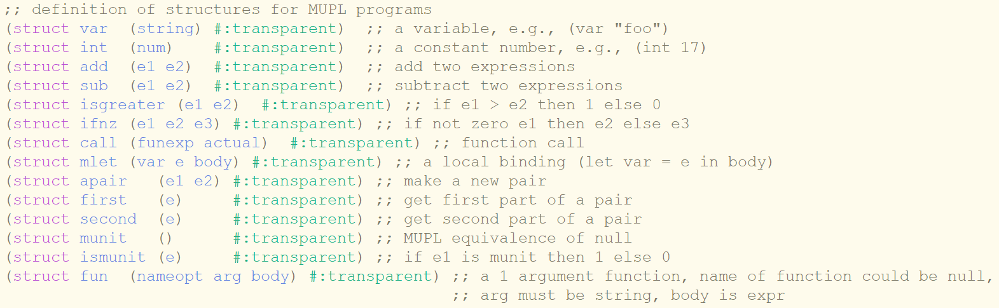

# MUPL Implementation
This project serves as a daily reminder on how code are compiled and evaluated under the hood, in particular:
- Let-expression's effect on environment
- Function evaluation
- Variable bindings
- Macros
- If-else statement

And especially the environment's role in evaluating expression.



There are 3 implementation of the evaluation method:
- (eval-exp **MUPL-expression**) Naive implementation, where everything, including function, are evaluated with the entire environment.
- (eval-mutable **MUPL-expression**) Evaluate function with a smaller environment that consists of only free variables, using set mutation
- (eval-non-mutable **MUPL-expression**) Evaluate function with a smaller environment as well, but with non-mutable set

To run correctly, create your own MUPL expression and evaluate it with one of the 3 method of evaluation above.

Here are some MUPL expression you can try yourself:
- ```(call (call mupl-filter (fun null "x" (isgreater (var "x") (int 0)))) (apair (int 3) (apair (int -4) (apair (int 42) (munit)))))```
- ```(call (call mupl-map (fun null "x" (ifnz (isgreater (int 0) (var "x")) (sub (int 0) (var "x")) (var "x")))) (apair (int -3) (apair (int 42) (apair (int -14) (munit)))))```


- **Definition:** Free variables are those not bounded by anything. i.e. (fun "add-y" "x" (add (var "x") (var "y"))) where "y" is a free variable as it is unknown should the environment be null, whereas "x" is the function argument, and will natural be known when the function is called.
